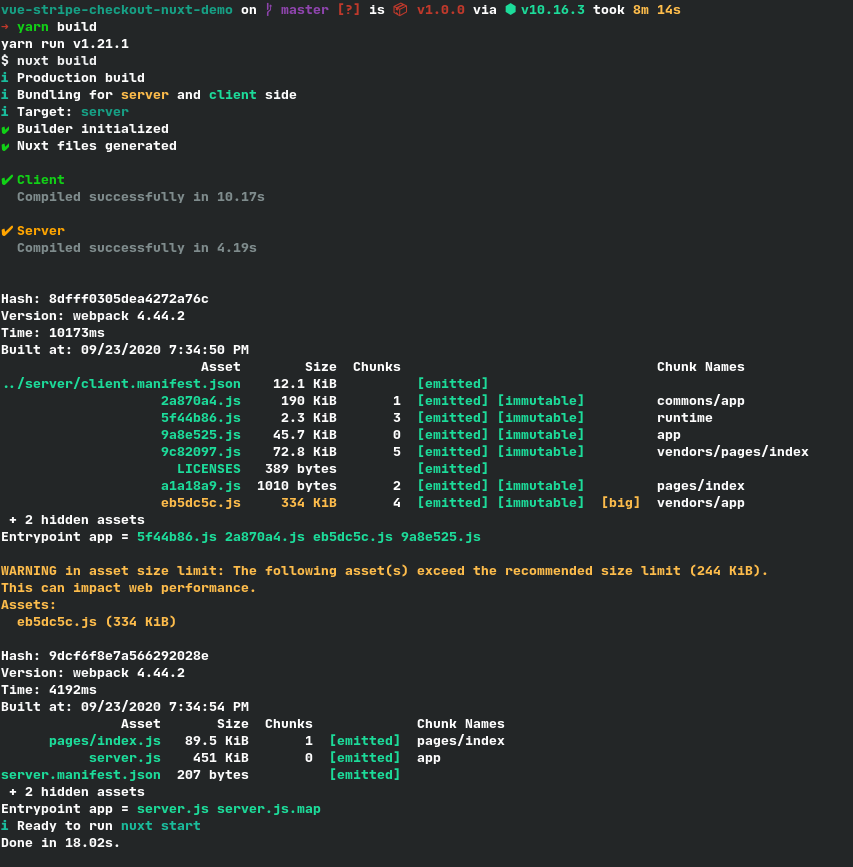
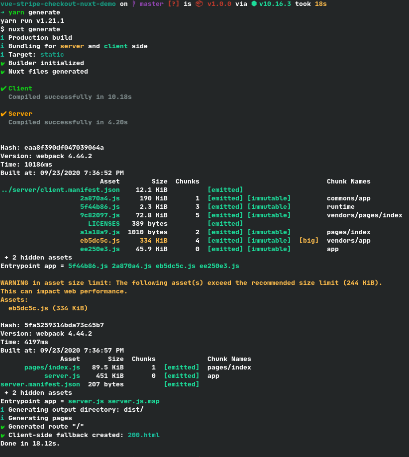

<p align="center">
  
  <h1 align="center">Vue Stripe + Nuxt.js 💳</h1>
</p>

A demo on how to implement Vue Stripe in Nuxt.js. This guide is targeted to those who are already familiar with Nuxt.js. For further explanation of the Nuxt.js features, kindly visit their beautifully written documentation website.

## Contents

- [Demo](#demo) - For most updated demo go to https://vuestripe.com
- [Installation](#installation)
- [Setup](#setup)
- [Usage](#usage)
- [Build & Generate Logs](build-logs)

## Demo

- SPA Demo - https://vue-stripe-checkout-nuxt-demo.web.app
- SSR Demo - https://vue-stripe-checkout-nuxt-demo.herokuapp.com

## Installation

**Yarn**
`yarn add @vue-stripe/vue-stripe`

**NPM**
`npm install @vue-stripe/vue-stripe -S`

## Setup

### Step 1

Add your publishable key to the `.env` file.

*.env*
```bash
STRIPE_PK=<your-stripe-publishable-key>
```

### Step 2

Register the new env in your `nuxt.config.js` under the `env` object.

*nuxt.config.js*
```javascript
export default {
  // ... other config
  env: {
    STRIPE_PK: process.env.STRIPE_PK,
  },
  // ... other config
};
```

### Step 3

Create a `vue-stripe.js` plugin in `plugins/` folder.

*plugins/vue-stripe.js*
```javascript
import Vue from 'vue';
import { StripeCheckout } from '@vue-stripe/vue-stripe';

export default () => {
  Vue.component('StripeCheckout', StripeCheckout);
};
```

So basically when this plugin is called, it just registers the `StripeCheckout` component globally.

Just inspect the `plugins/vue-stripe.js` file in this repository to see the additional implementation of Stripe Elements.

### Step 4

Register the new plugin in your `nuxt.config.js` under the `plugins` array.

*nuxt.config.js*
```javascript
export default {
  // ... other config
  plugins: [
    { src: '~/plugins/vue-stripe.js', ssr: false },
  ],
  // ... other config
};
```

The most important part here is the `ssr` property. This will tell nuxt that this plugin will only be used in client side. Thus, eliminating the error `window is not defined`. See [VueStripeCheckout#issue#72](https://github.com/jofftiquez/vue-stripe-checkout/issues/72).

## Usage

After successfully setting up the env, and the plugin, you can now use `StripeCheckout` like a normal Vue component. Like so:

```html
<template>
  <div>
    <stripe-checkout
      ref="checkoutRef"
      :pk="pk"
      :items="items"
      :successUrl="successUrl"
      :cancelUrl="cancelUrl"
    />
    <button @click="checkout">Checkout</button>
  </div>
</template>

<script>
export default {
  data () {
    this.pk = process.env.STRIPE_PK;
    return {
      items: [
        {
          sku: 'sku_FdQKocNoVzznpJ',
          quantity: 1,
        },
      ],
      successUrl: 'http://localhost:3000',
      cancelUrl: 'http://localhost:3000',
    };
  },
  methods: {
    checkout () {
      this.$refs.checkoutRef.redirectToCheckout();
    },
  },
};
</script>
```

## Build logs

**nuxt build**



**nuxt generate**


